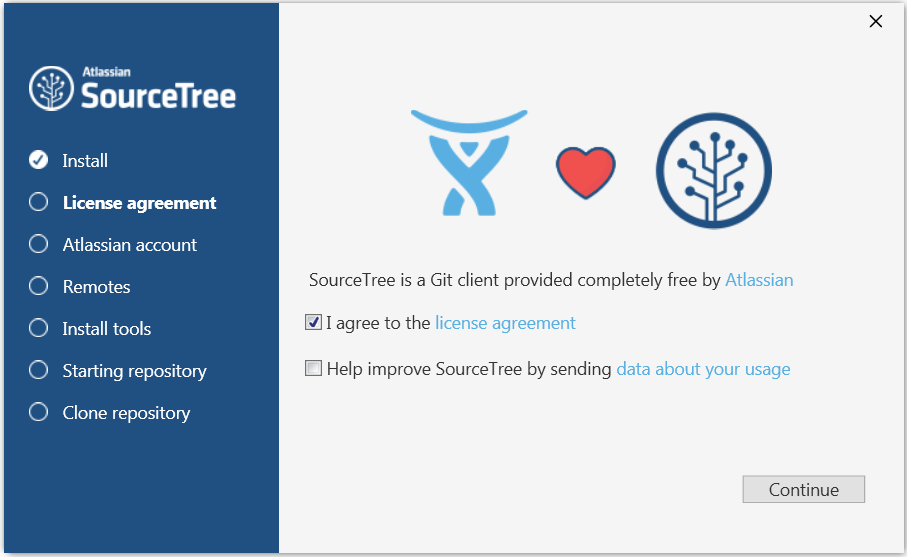
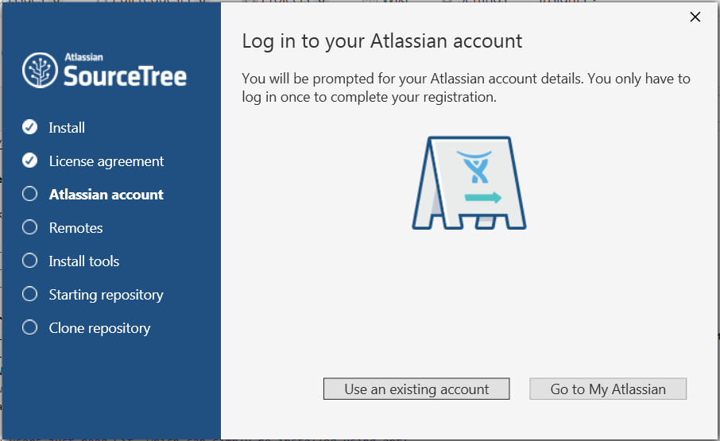
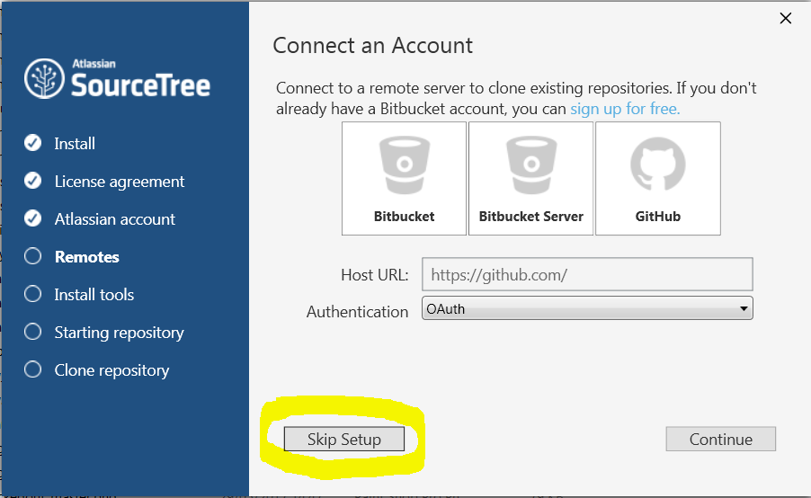
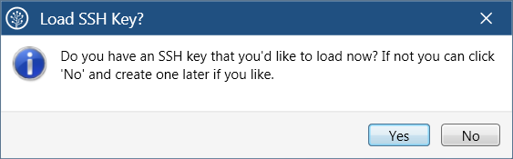
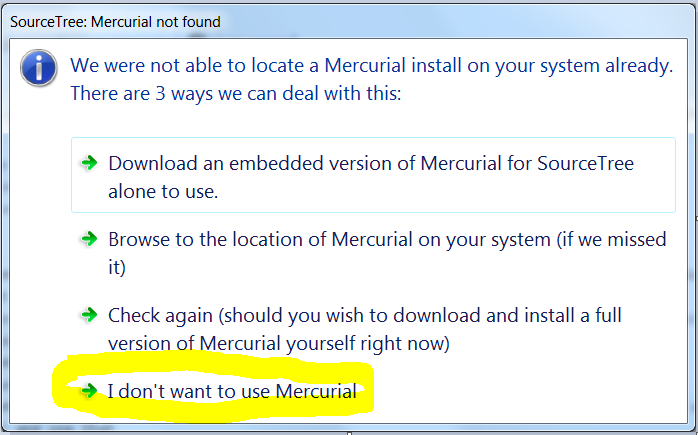
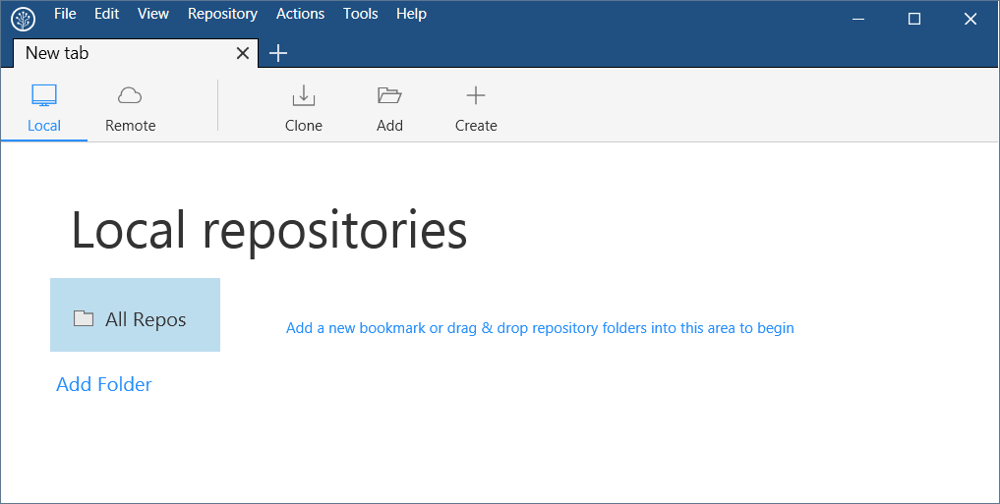

https://github.com/NERC-CEH/git-introduction/blob/master/Exercises.md

# Git Version Control Exercises

These exercises introduce version control using Git.  We will do the following 3 sessions:

- **Exercise 1.** Create and manage your first Git repository
- **Exercise 2.** Work online with Github
- **Exercise 3.** Team work via branching/merging and pull requests

### Prerequisites
There are many clients for Git, in these exercises you will use SourceTree to manage Git.  SourceTree is a Git client for Windows and Mac.  If you haven't yet installed it here is how to install it on Windows:
- In Windows Explorer **Open** Y:\user_apps\SouceTree\SourceTreeSetup-2.0.20.1.exe and fill in the details it asks for as follows (NOTE: the official download is https://www.sourcetreeapp.com that you may wish to use outside CEH):

  - License Agreement: accept the license agreement


  - Atlassian account: either login to your existing account, or else Go to My Atlassian, create a new account (look for **Need an account? Sign up.**) and use that


  - Now **Skip Setup** - we will do everything else in the exercises


  - Load SSH Key?: No - this may be a later exercise


  - Mercurial not found: don't worry about this, just select the bottom option **I don't want to use Mercurial** - if you need to know, Mercurial is ....


  - You are now ready to do the exercises and should have SourceTree installed, open and looking like this:


### A note about Git from the command line and Linux users
Git can be used from the command line rather than via a graphical client like SourceTree.  This can be especially useful for linux users and it also provides access to everything that Git can do, which isn't necessarily true of a graphical Git client.  Whilst these exercises use SourceTree, we have included panels of Git commands to illustrate how to achieve the same result from the command line.  These should help you understand the basics within the context of the exercises.  There are great tutorials and documentation out there, here are some links that will help your learning:
- https://git-scm.com/book/en/v2/Getting-Started-The-Command-Line: Command line tutorial, page by page
- https://try.github.io: Interactive command line tutorial
- https://git-scm.com/docs: git command line reference

There is a Terminal Window within Source Tree if you want to try out the command line:  Actions > Open in Terminal

To install Git on Linux use the following:

```
sudo apt-get update
sudo apt-get install git
```

## Exercise 1. Create your first Git repository

This exercise will take you through your first steps of applying version control using Git to a folder and its contents.  You will cover:

- enable git on a folder
- review the status of files in the folder
- repeatedly edit files and add your changes to git
- review changes
- checkout a previous version of your changes

### Step 1.  Create your working project
This step creates project folder with sub-folders and files ready for the rest of the exercise.

- Download <https://github.com/NERC-CEH/git-introduction/raw/master/MyProject.zip> and unzip to a convenient working location.  This provides you with a working folder containing sub-folders and files for you to edit and version control.  You should have something like this:

- The location of the root folder (eg C:\Users\jon\Documents\MyProject) will be needed in Step 2.  

### Step 2.  Enable Git on your new project
This step adds the Git repository to the root of your project folder.

- Open SourceTree
- Press the **Create** button, to show the **Create a repository** form.
- Fill in the fields as follows:
  - **Destination path**: the location of the root folder from step 1 - in otherwords, the folder you want to version control (eg C:\Users\jon\Documents\MyProject)
  - **Name**: a simple name to identify your repository in SourceTree 
  - **Git or Mercurial** drop down: select Git
  - **Create repository on account** drop down: make sure it is **not** selected


- Press the **Create** button, to create a Git repository in the root folder of your project
- You should see the following warning, which simply alerts you to the fact that it will add a Git repository to an existing folder, rather than create the folder for you (which is another way of starting your version controlled project) - press **yes** to accept:


- SourceTree will now display the state of your version controlled project, with all files in the **Unstaged files** area:


- Also, if you look in the root of your project in Windows Explorer you will now see a new folder called '.git', this is the Git repository (you may need to enable 'Show hidden folders' to see it)


### Step 3. Populate your new repository
Your new Git repository does not yet contain any files to version control, that is all files are currently Untracked.  This is why they have a question mark next to them in the previous image.  This step adds all files of the project into Git.

- Add all these files to the **Staged files** area by pressing the **Stage All** button.  


- Note that they are now displayed in the **Staged files** area with green plus icon, indicating they are brand new files ready to be committed to the Git repository


- Type in a commit message, eg 'Initial commit to add all project files' and press **Commit**


- All files are committed to the Git repository and both the 'Unstaged files' and 'Staged files' areas are empty


### Step 4.  Edit files and commit changes to Git 
In this step you will edit some files and commit your changes to Git.

- In your favourite text editor, open a couple of the downloaded files (eg elephants/Asian.txt and elephants/African.txt) and make some edits to them.
- In SourceTree, the files you edited are shown in the **Unstaged** area with a yellow '...' icon next to them.  If you highlight one, then your changes are shown:


- Add to the staging area and commit with a suitable message as you did before.


### Step 5. Review the Git log and checkout a version
In this step you will look at the log of your edits and checkout one of those revisions.

- Repeat Step 4. at least twice to build up a log of changes
- Now take a look at the log in Git by pressing the **Log/History** tab at the bottom


- There are 3 panels showing different aspects of the log:
  1. firstly each commit together with its commit message is shown in the top panel
  2. select a commit in the top panel to display which files were edited (bottom left panel)
  3. select a file in the bottom left panel to display its edits (bottom right panel)


- you will now checkout one of your versions shown in the log.  When you checkout a specific commit all files in your working copy will be exactly as they were when you comitted those changes.
- on your log, right click an earlier commit (eg in my example 'Added info about elephant trunks') and select **Checkout...** from the context menu:


- you will see the following warning, for this exercise it is safe to ignore it:


- the log shows the **HEAD** tag on the commit you just checked out - this indicates all files in your working copy are now as they were when you make that commit.  If you look at the files in that folder you will see all work done after that commit is missing.  This is one way you can return to previous versions of files.


- Return to the latest version of your work again by checking out the latest commit of the **master** branch - this is done by right clicking on the **master** and selecting **Checkout...** from the context menu


- You should now be back at your latest edit, with the files in your working folder containing all edits


### Step 6.  Ignoring files
It is very useful to be able to **not** version control some files in your project.  This is done by adding a file named **.gitignore** to the root folder of your project.  File names and file patterns added to it are ignored by Git.
- create two files in the root your project called **.ignore** and **temporary_file.txt** respectively.  Look at your **Unstaged files** panel in SourceTree.  As expected you see both files ready to be staged and committed:


- in your favourite text editor open **.gitignore**, add the single line **temporary_file.txt**, save and close.  Return to SourceTree's **Unstaged files** panel (refresh if necessary - f5) and this time only the **.gitignore** file is visible.  This shows that Git is now ignoring the temporary file and it can't be staged or committed to Git.  You can use a file pattern like temp*.* instead to widen the scope of what is ignored:


- stage and commit the .gitignore file

## Exercise 2.  Work on-line with Github
Until now your Git repository has only existed locally inside your project folder.  **Github** is a service that allows you to host your Git repository on-line so you can access it from anywhere, share it, collaborate and more.  We have a NERC-CEH organisation in Github, which you can join and it will provide a private place for you to host your repositories.  In this exercise you will:
  - register with Github
  - join the NERC-CEH organisation
  - create a repository in the NERC-CEH organisation
  - work with the repository locally and synchronise with Github
  
### Step 1.  Create a Github account and join the NERC-CEH organisation
- If you do not yet have an account with Github, open a browser, go to https://github.com and sign up using your CEH e-mail address.  


- You need to join the NERC-CEH organisation, but this is by invitation only.  So, once you have signed-up let us know in the classroom so we can invite you.  If doing this outside the lesson, please e-mail foo@ceh.ac.uk and you will be invited.  Accept the invitation by...???...under profile perhaps...needs checking.

### Step 2.  Create a private repository
- In a browser, go to https://github.com, make sure you are logged in and select the the **New repository ** button to begin creating a new repository


- Fill in the form as below and press **Create repository**
  - **Owner**: NERC-CEH
  - **Repository Name**: something brief that describes it
  - **Description**: add a note to say it was created as a tutorial exercise
  - **Public/Private**: select Private, which means you manage who can see it
  - **Initialize repository with README**: tick this box, it is good to have a README at the root of your project
  - **Add .gitignore**: leave this as None, you will add your own from exercise 1
  - **Add a license**: not really applicable in a private repository, but you may want to see what they provide


- You now have an almost empty repository on Github that should look something like this:


### Step 3.  Download (clone) the Github repository
To start adding and managing files you need to download your Github repository.  This is called **cloning** your repository.

- Go to your repository on Github (eg https://github.com/NERC-CEH/jons_exercise_repo)
  - press the **Clone or download** button
  -  press the **copy to clipboard** button, as shown highlighted below (make sure the URL shown starts with **https** and not **git** - otherwise select **Use HTTPS** nearby):


- Open SourceTree and go to **File** > **Clone / New...** > **Clone tab**, and fill in the form like this:
  - **Source Path / URL**: paste the url you just copied from Github (eg https://github.com/NERC-CEH/jons_exercise_repo.git)
  - **Destination Path**: this is the folder where you want to save the repository locally.  For example: C:\Users\jcoop\Documents\repos\jons_exercise_repo - **NOTE**: the final folder named in that path must not yet exist as it will be created by SourceTree (eg jons_exercise_repo), however the rest of the folder structure must already exist (eg C:\Users\jcoop\Documents\repos)
  - **Name**: this is the name that SourceTree will display, keep it the same as the repository name (eg jons_exercise_repo)
  - Press **Clone**


### Step 4.  Add files to your local copy
 - You will now have an empty local copy ready to use - in Sourcetree it looks like this, the same as in Exercise 1:

 
 - You will now add some files to this repository.  
   - Open Windows Explorer go to the project you created in Exercise 1
   - Copy everything from your Exercise 1 project **EXCEPT the .git folder** into the repository you just created, for example from D:\repos\MyProject\ to D:\repos\jons_exercise_repo\ (alternatively you could start afresh with the contents of the zip from Exercise 1 - https://github.com/NERC-CEH/git-introduction/raw/master/MyProject.zip):


- Review your repository in source tree, you will see the new files in the Unstaged area - press **Stage all** to stage them:


- Commit the staged files with a brief message:


- Now you should see a small **number 1** next to the button called **Push**, near the top.  This indicates you have 1 commit in your local repository that is not **pushed** up to Github.  Each time you commit changes this number will increase:


### Step 5.  Push to Github
- You will now Push your changes to Github.  You don't have to do this with every commit you make.  To Push your changes, click the **Push** button shown above.  You will get the following dialogue.  Just keep just the first row ticked **'Push local master to remote master'** - now finally push it all up to Github by pressing the **Push** button at the bottom of the dialogue:


- After a short delay, your changes will be pushed to Github and SourceTree will indicate that no Pushes are pending.

- Review your repo on Github (eg https://github.com/NERC-CEH/jons_exercise_repo).  You will see your new files and plenty of ways to explore them and their changes.  But most of all, your project is now safely up on Github and you have a local clone of the repository where you can manage your edits:


## Exercise 3.  Team working
Until now, you have been the only person working on your Github hosted repository.  This may be sufficient for your needs.  However, you may be part of a team where you all need to edit the same code base in a managed way.  In this exercise you will cover:
- branch, merge and checkout - this will allow you to work on a **branch** of your repository (a bit like a copy), merge those branches back into the **master** branch and move between branches
- pulling down changes from your team and resolving conflicts
- creating and accepting pull requests, which is a nice controlled way to merge branches back into the **master** branch

### Step 1.  Form a team
- Team up with at least one other person.  You will work together to see how your changes affect each other.

###  Step 2.  Clone just one team member's repository
- Choose whose repository from Exercise 2 you are all going to work with.
- Those of you who don't yet have that repository locally must clone it.  Follow the instructions from Exercise 2 Step 3 and use the URL of the repository you have chosen to work with.
- Everyone in your team should now have a clone of the same repository.

###  Step 3.  One team member creates a branch, commits some edits and pushes to Github
-  Choose **just one** team member to do this step, but everyone should follow along...

- So far, all your commits have been to the default branch in your Git repository - this branch is called **master**.  You may have already noticed **master** in SourceTree as highlighted here (under the **Log / History** tab):


- Create a new branch by pressing the **Branch** button and fill out the dialogue:
  - **New Branch**: the name of the new branch, call it **giraffe**
  - **Commit**: select **Working copy parent**, which means the branch will be created from your current working copy
  - **Checkout New branch**: tick this, it means that your working copy will now refer to the new branch and all your changes and commits go to this new branch
  - Press **Create Branch** to create it


- The new branch is shown in SourceTree.  Note that where it is shown on the left under BRANCHES, it is in **bold** with a small circle next to it - this indicates that it (and not **master**) is checked out, so all changes you commit to Git will be on this new branch:


- With your new branch **checked out** make some changes - in Windows Explorer create a folder at the root of your project called **giraffes**, within that folder create a new text file called Northern.txt that contains some text about the Northern Giraffe.


- In SourceTree, stage and commit your edits with a brief message:


- Now **Push** all your changes to Github (as in Exercise 2 Step 5)

###  Step 4.  Team members Pull down new changes
- Now it is the turn of the team members who do not yet have the changes.  
