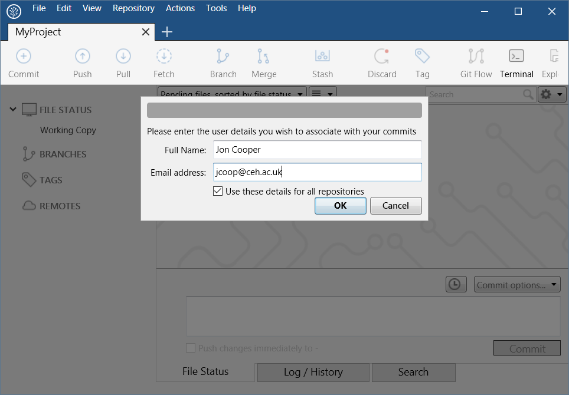
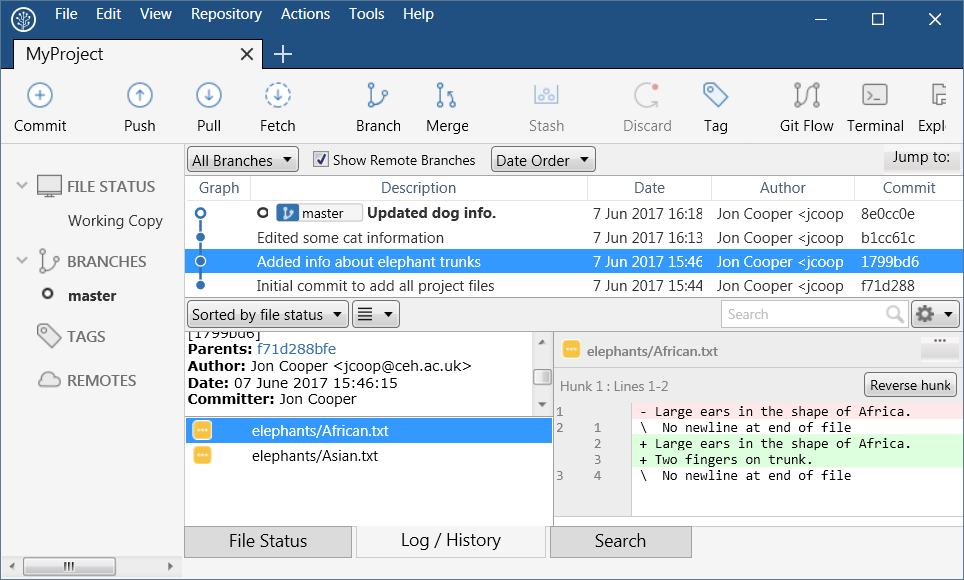

https://nerc-ceh.github.io/version_control/exercises

- [Exercise 1.](https://nerc-ceh.github.io/version_control/exercise1) Create and manage your first Git repository
- [Exercise 2.](https://nerc-ceh.github.io/version_control/exercise2) Work online with Github
- [Exercise 3.](https://nerc-ceh.github.io/version_control/exercise3) Team work via branching/merging and pull requests

# Exercise 1. Create your first Git repository

This exercise will take you through your first steps of applying version control using Git to a folder and its contents.  You will cover:

- enable git on a folder
- review the status of files in the folder
- repeatedly edit files and add your changes to git
- review changes
- checkout a previous version of your changes

### Step 1.  Create your working project
This step creates a project folder with sub-folders and files ready for the rest of the exercise.

- Download <https://nerc-ceh.github.io/version_control/MyProject.zip> and unzip to a convenient working location (eg under your **Documents** folder).  This provides you with a working folder containing sub-folders and files for you to edit and version control.  You should have something like this:

- The location of the root folder (eg C:\Users\jon\Documents\MyProject) will be needed in Step 2.  

### Step 2.  Enable Git on your new project
This step adds the Git repository to the root of your project folder.

- Open SourceTree
- Press the **Create** button, to show the **Create a repository** form.
- Fill in the fields as follows:
  - **Destination path**: the location of the root folder from step 1 - in otherwords, the folder you want to version control (eg C:\Users\jon\Documents\MyProject)
  - **Name**: a simple name to identify your repository in SourceTree 
  - **Git or Mercurial** drop down: select Git
  - **Create repository on account** drop down: make sure it is **not** selected

- Press the **Create** button, to create a Git repository in the root folder of your project
- You should see the following warning, which simply alerts you to the fact that it will add a Git repository to an existing folder, rather than create the folder for you (which is another way of starting your version controlled project) - press **yes** to accept:

- You **may** be prompted to provide your name and e-mail.  If you've set this up before then it won't prompt you.  If required, enter you details and tick the **Use these details on all repositories** so you don't have to do it again.  Your details are used to add your identity to the log when you **Commit** edits:

- SourceTree will now display the state of your version controlled project, with all files in the **Unstaged files** area:

- Also, if you look in the root of your project in Windows Explorer you will now see a new folder called '.git', this is the Git repository (you may need to enable 'Show hidden folders' to see it)

### Step 3. Populate your new repository
Your new Git repository does not yet contain any files to version control, that is all files are currently **Untracked**.  This is why they have a question mark next to them in SourceTree.  This step puts all your files into Git, which is a two step process of **Staging** and then **Committing** them.

- Add all files to the **Staged files** area by pressing the **Stage All** button.  

- Note that they are now displayed in the **Staged files** area with green plus icon, indicating they are brand new files ready to be committed to the Git repository

- Type in a commit message, eg 'Initial commit to add all project files' and press **Commit**

- All files are committed to the Git repository and both the 'Unstaged files' and 'Staged files' areas are empty

### Step 4.  Edit files and commit changes to Git 
In this step you will edit some files and commit your changes to Git.

- In your favourite text editor, open a couple of the downloaded files (eg elephants/Asian.txt and elephants/African.txt) and make some edits to them.
- In SourceTree, the files you edited are shown in the **Unstaged** area with a yellow '...' icon next to them.  If you highlight one, then your changes are shown:

- Add to the staging area and commit with a suitable message as you did before.

### Step 5.  Stage specific files
In this step you will edit two files, but **Stage** and **Commit** them separately to illustrate how commits can be used to organise your edits.

- Add some new text to **two** files (eg cats/Siamese.txt and dogs/spaniel.txt)

- In **Unstaged files** select just **one** edited file, then press **Stage Selected**

- This time, only your selected file is staged ready to commit.  Give it an appropriate message and then **Commit**

- You will see one file left in **Unstaged files**, stage and commit it with a message:

### Step 6. Review the Git log and checkout a version
You should now have a range of file changes committed to Git.  In this step you will look at the log of your edits and checkout one of those revisions.

- Take a look at the Git log by pressing the **Log/History** tab at the bottom:

- There are 3 panels showing different aspects of the log:
  1. firstly each commit together with its commit message is shown in the top panel.
  2. select a commit in the top panel to display which files were edited (bottom left panel)
  3. select a file in the bottom left panel to display its edits (bottom right panel)

- you will now checkout one of the commits shown in the log.  When you checkout a specific commit all files in your working copy will be exactly as they were when you committed those changes.  On your log, right click an earlier commit in the top panel (eg in my example 'Added info about elephant trunks') and select **Checkout...** from the context menu:

- you will see the following warning, for this exercise it is safe to ignore it (DO NOT tick **Clean (discard all changes)**):

- the log shows the **HEAD** tag on the commit you just checked out - this indicates all files in your working copy are now as they were when you make that commit.  If you look at the files in that folder in Windows Explorer you will see all work done after that commit is missing.  This is one way you can get hold of previous versions of files.

s

- Return to the latest version of your work again by checking out the latest commit of the **master** branch - this is done by right clicking on the **master** and selecting **Checkout...** from the context menu

- You should now be back at your latest edit, with the files in your working folder containing all edits

### Step 6.  Tagging
As you can imagine, the Git log soon fills with many commits.  There are times when you will want to identify a specific point in the log as something more significant - such as when you have completed major blocks of work, reached a milestone or finished a major change to modelling or website code.  This is a release point that you can then refer to via a version number - eg v1.0.1 of my model or website.  In Git this is called an **annotated tag**.  The complete state of your repository is stored against this tag.  This step will add an annotated tag to your repository.

- Select the **Tag** option highlighted below, fill in the dialogue like this:
  - **Tag name**: your version number (eg v1.0.0)
  - **Working copy parent** or **Specified commit**: choose either the current state of your repository or a specific commit that this tag will be tied to
  - **Advanced Option**: for this exercise we aren't using them
  - **Add Tag**: press to add the tag
  

- You will now see the tag in your **Log/History** view and you can also list all tags on the left by selecting the **Tags** dropdown:

- When you need your files in the state referred to by the tag, just **checkout** that tag as you did earlier in this exercise for a specific commit.  For now though, leave your repository as it is.

### Step 7.  Ignoring files
It is very useful to be able to exclude some files from version control, for example you may have other processes that generate temporary files in your project.  Ignoring files is done by adding a file named **.gitignore** to the root folder of your project.  File names and file patterns added to it are ignored by Git.  SourceTree makes this easy to do as follows.

- create a file in the root your project called **temporary_file.txt**, this is the one you are going to remove from version control.

- In SourceTree the file appears in the **Unstaged files** panel as untracked (purple question mark).  To remove it from version control, right click it and in the context menu select **Ignore**:

You will be given several options, that allow you to ignore multiple files or just this one.  Select **Ignore exact filename(s)** to only ignore this file and press **OK**.

- In the **Unstaged** area the file has disappeared since it is now being ignored.  Another file has appeared, called .gitignore, this is just a file that tells Git what to ignore.  **Stage** and **Commit** this file with a brief message.

- In Windows Explorer, take a look in the root of your project.  You will see that temporary_file.txt is still there.  You can open it and edit it.  However, changes to this file will not appear in SourceTree because you have now told Git to ignore it.

### End of exercise 1