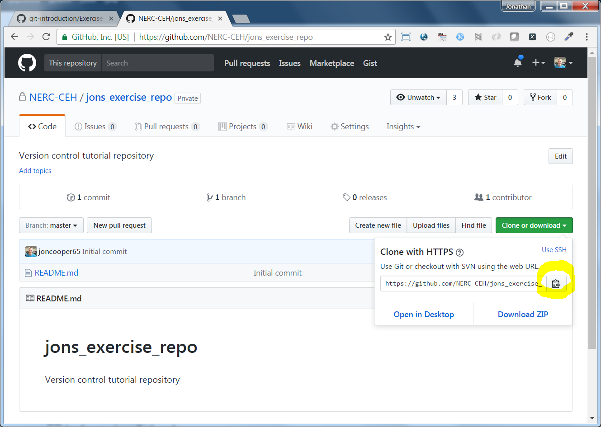

https://nerc-ceh.github.io/version_control/exercises

- [Exercise 1.](https://nerc-ceh.github.io/version_control/exercise1) Create and manage your first Git repository
- [Exercise 2.](https://nerc-ceh.github.io/version_control/exercise2) Work online with Github
- [Exercise 3.](https://nerc-ceh.github.io/version_control/exercise3) Team work via branching/merging and pull requests

# Exercise 2.  Work on-line with Github
Throughout [Exercise 1](https://nerc-ceh.github.io/version_control/exercise1) your Git repository only existed locally to you inside your project folder.  You will now learn about hosting it remotely on **Github**.  Github is a service that allows you to host your Git repository on-line so you can access it from anywhere, share it, collaborate and more.  We have a NERC-CEH organisation in Github that you can join and it will provide a private place for you to host your repositories.  In this exercise you will:
  - register with Github
  - join the NERC-CEH organisation
  - create a repository in the NERC-CEH organisation
  - work with the repository locally and synchronise with Github
  
### Step 1.  Create a Github account and join the NERC-CEH organisation
- If you do not yet have an account with Github, open a browser, go to https://github.com and sign up using your CEH e-mail address.  

- You need to join the NERC-CEH organisation, but this is by invitation only.  So, once you have signed-up let us know in the classroom so we can invite you.  If doing this outside the lesson, please e-mail foo@ceh.ac.uk and you will be invited.  Accept the invitation by...???...under profile perhaps...needs checking.

### Step 2.  Create a private repository
- In a browser, go to https://github.com, make sure you are logged in and select the the **New repository** button to begin creating a new repository

- Fill in the form as below and press **Create repository**
  - **Owner**: NERC-CEH
  - **Repository Name**: something brief that describes it
  - **Description**: add a note to say it was created as a tutorial exercise
  - **Public/Private**: select Private, which means you manage who can see it
  - **Initialize repository with README**: tick this box, it is good to have a README at the root of your project
  - **Add .gitignore**: leave this as None, you will add your own from exercise 1
  - **Add a license**: not really applicable in a private repository, but you may want to see what they provide

- You now have an almost empty repository on Github that should look something like this:

### Step 3.  Download (clone) the Github repository
To start adding and managing files you need to download your Github repository.  This is called **cloning** your repository.

- Go to your repository on Github (eg https://github.com/NERC-CEH/jons_exercise_repo)
  - press the **Clone or download** button
  -  press the **copy to clipboard** button as shown highlighted below (make sure the URL shown starts with **https** and not **git** - otherwise select **Use HTTPS** nearby):

- Open SourceTree and go to **File** > **Clone / New...** > press the **Clone** option and fill in the form like this:
  - **Source Path / URL**: paste the url you just copied from Github (eg https://github.com/NERC-CEH/jons_exercise_repo.git)
  - **Destination Path**: this is the folder where you want to save the repository locally.  For example: C:\Users\jcoop\Documents\repos\jons_exercise_repo - **NOTE**: the final folder named in that path must not yet exist as it will be created by SourceTree (eg jons_exercise_repo), however the rest of the folder structure must already exist (eg C:\Users\jcoop\Documents\repos)
  - **Name**: this is the name that SourceTree will display, keep it the same as the repository name (eg jons_exercise_repo)
  - Press **Clone**

### Step 4.  Add files to your local copy
 - You will now have an empty local copy ready to use - in Sourcetree it looks like this, the same as in Exercise 1:

 
 
 - You will now add some files to this repository.  
   - Open Windows Explorer go to the project you created in Exercise 1
   - Copy everything from your Exercise 1 project **EXCEPT the .git folder** into the repository you just created, for example from D:\repos\MyProject\ to D:\repos\jons_exercise_repo\ (alternatively you could start afresh with the contents of the zip from Exercise 1 - https://nerc-ceh.github.io/version_control/MyProject.zip):

Before:

After:

- Review your repository in source tree, you will see the new files in the Unstaged area - press **Stage all** to stage them:

- Commit the staged files with a brief message:

- Now you should see a small **number 1** next to the button called **Push**, near the top.  This indicates you have 1 commit in your local repository that is not **pushed** up to Github.  Each time you commit changes this number will increase:

### Step 5.  Push to Github
- You will now Push your changes to Github.  You don't have to do this with every commit you make.  To Push your changes, click the **Push** button shown above.  You will get the following dialogue.  Just keep just the first row ticked **'Push local master to remote master'** - now finally push it all up to Github by pressing the **Push** button at the bottom of the dialogue:

- After a short delay, your changes will be pushed to Github and SourceTree will indicate that no Pushes are pending.

- Review your repo on Github (eg https://github.com/NERC-CEH/jons_exercise_repo).  You will see your new files and plenty of ways to explore them and their changes.  But most of all, your project is now safely up on Github and you have a local clone of the repository where you can manage your edits:

