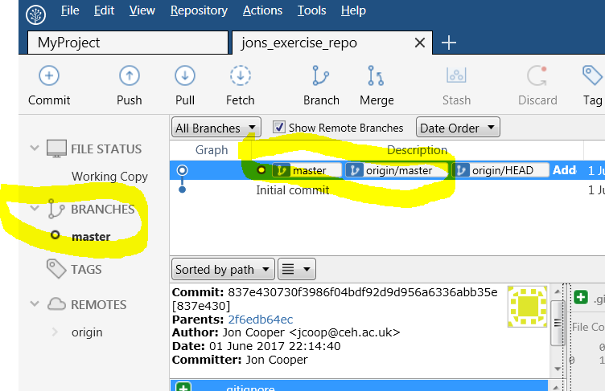

https://nerc-ceh.github.io/version_control/exercises

- [Exercise 1.](https://nerc-ceh.github.io/version_control/exercise1) Create and manage your first Git repository
- [Exercise 2.](https://nerc-ceh.github.io/version_control/exercise2) Work online with Github
- [Exercise 3.](https://nerc-ceh.github.io/version_control/exercise3) Team work via branching/merging and pull requests

# Exercise 3.  Team working
Until now, you have been the only person working on your Github hosted repository.  This may be sufficient for your needs.  However, you may be part of a team where you all need to edit the same code base in a managed way.  In this exercise you will cover:
- branch, merge and checkout - this will allow you to work on a **branch** of your repository (a bit like a copy), merge those branches back into the **master** branch and move between branches
- pulling down changes from your team and resolving conflicts
- creating and accepting pull requests, which is a nice controlled way to merge branches back into the **master** branch

### Step 1.  Form a team
- Team up with at least one other person.  You will work together to see how your changes affect each other.

###  Step 2.  Clone just one team member's repository
- Choose whose repository from Exercise 2 you are all going to work with.
- Those of you who don't yet have that repository locally must clone it from GitHub.  Follow the instructions from [Exercise 2 Step 3](https://nerc-ceh.github.io/version_control/exercise2#step3) and use the URL of the repository you have chosen to work with.
- Everyone in your team should now have a clone of the same repository.

###  Step 3.  One team member creates a branch, commits some edits and pushes to Github
-  Choose **just one** team member to do this step, but everyone should follow along...

- So far, all your commits have been to the default branch in your Git repository - this branch is called **master**.  You may have already noticed **master** in SourceTree as highlighted here (under the **Log / History** tab):

- Create a new branch by pressing the **Branch** button and fill out the dialogue:
  - **New Branch**: the name of the new branch, call it **giraffe**
  - **Commit**: select **Working copy parent**, which means the branch will be created from your current working copy
  - **Checkout New branch**: tick this, it means that your working copy will now refer to the new branch and all your changes and commits go to this new branch
  - Press **Create Branch** to create it

- The new branch is shown in SourceTree.  Note that where it is shown on the left under BRANCHES, it is in **bold** with a small circle next to it - this indicates that it (and not **master**) is checked out, so all changes you commit to Git will be on this new branch:

- With your new branch **checked out** make some changes - in Windows Explorer create a folder at the root of your project called **giraffes**, within that folder create a new text file called Northern.txt that contains some text about the Northern Giraffe.

- In SourceTree, stage and commit your edits with a brief message:

- Now **Push** all your changes to Github (as in Exercise 2 Step 5)

###  Step 4.  Team members Pull down new changes
- Now it is the turn of the team members who do not yet have the changes.  
