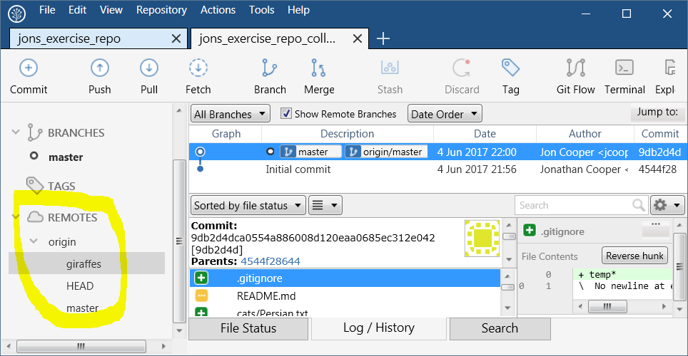
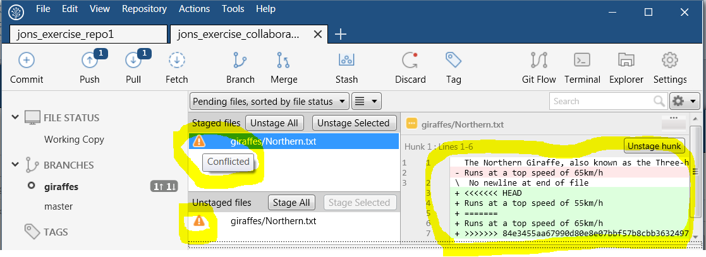
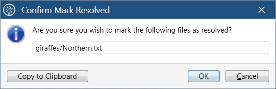

https://nerc-ceh.github.io/version_control/exercises

- [Exercise 1.](https://nerc-ceh.github.io/version_control/exercise1) Create and manage your first Git repository
- [Exercise 2.](https://nerc-ceh.github.io/version_control/exercise2) Work online with Github
- [Exercise 3.](https://nerc-ceh.github.io/version_control/exercise3) Team work via branching/merging and pull requests

# Exercise 3.  Team working
In the previous exercises you have been the only person working on your Github hosted repository.  This may be sufficient for your needs.  However, you may be part of a team where you all need to edit the same code base in a managed way.  In this exercise each team member will work on a clone of the same Github repository and share their changes to the others via Github using **Pull** and **Push** actions.  

To do this effectively you will also learn about **Branching** and **Merging**.  So far, all your commits have been to the default branch - this branch is called **master**.  You may have already noticed **master** in SourceTree as highlighted here (under the **Log/History** tab):

However, it is common to create new branches for specific pieces of work.  This isolates your changes from the master branch, and any other branch that may have been created.  It is only when you are ready that these changes are merged from your new branch into the master branch (or potentially any branch) via a **Pull Request**.  This is very useful in busy projects with multiple editors and lots going on.  There is more than one way to create a branch, in this exercise you will do it via Github.

Overall you will learn about:
 - Creating a branch
 - Pulling down changes from your team and resolving conflicts
 - Creating and accepting pull requests to merge a branch back into the master branch

### Step 1.  Form a team
- Team up with at least one other person.  You will work together to see how your changes affect each other.

###  Step 2.  Collaborate on one of your Github repositories 
- Choose whose repository from Exercise 2 you are all going to work with.  The owner of this repository must add their team mates as **collaborators** in Github so they can all work on it.  The owner should go to the repository on Github, select the **Settings** tab near the top, then **Collaborators & teams** and then add their team mates using the search box in the **Collaborators** panel.  They will receive an e-mail invitation that they should accept.  If that sounded tricky, [this help page on Github may be clearer](https://help.github.com/articles/inviting-collaborators-to-a-personal-repository/).  This is what the add collaborators page looks like:

###  Step 3.  Collaborators clone repository
Everyone needs a local clone of the repository.  The owner should already have one.  However, the collaborators (ie other team members) must clone it from Github.  Follow the instructions from [Exercise 2 Step 3](https://nerc-ceh.github.io/version_control/exercise2#step-3--download-clone-the-github-repository) and use the URL of the repository you are collaborating on.
- Everyone in your team should now have a local clone of the same repository ready to make edits to and to manage in SourceTree.

###  Step 4.  Create a new branch via Github
The team needs to do some urgent work documenting Giraffes!  One person should now create a new Giraffes branch in Github ready for the whole team to **checkout** and work on.
- one person in the team go to the repository in Github, and on the **Code** tab, find the **Branch** drop down, select it, type **giraffes** in the box and press return:

- you will now see the new branch available in Github:

###  Step 5.  Fetch and checkout the new branch
Everyone now needs the giraffe branch in their local repository so they can work on the files.  This is a two stage process.

- Firstly, with your repository open in SourceTree, press the **Fetch** button and in the dialogue just tick **Fetch from all remotes**:

- This has fetched information about your new branch, which you can find under the **Remotes** > **origin** drop down on the left, notice the **giraffes** branch has appeared:

- Secondly, checkout the giraffes branch by right clicking on it and selecting **Checkout origin/giraffes...**

- In the **Checkout** dialogue that appears, select the **Checkout New Branch** and keep the defaults as shown below:

- You will all now have the giraffe branch in your local repository checked out ready to use, like this:

###  Step 6.  Pushing and pulling changes
Time to start working as a team.  You will now add some content to the giraffes branch you all have checked out.  Two people will work on separate parts and push them up to Github.

- **Person 1:** In Windows Explorer create a folder at the root of your project called **giraffes**, within that folder create a new text file called Northern.txt that contains some text about the Northern Giraffe.

- **Person 1:** In SourceTree, stage and commit your edits with a brief message:

- **Person 1:** In your **Log/History** view you will see the Giraffe branch ahead of the Master branch, since it has changes that Master does not.  You will also see that a number 1 has appeared in several places indicating that there is a new commit that has not been pushed up to Github:

- **Person 1:** Now **Push** your changes to Github as you have done before, pressing the **Push** button.  This time you will be asked which branches to push, since you have only worked on Giraffe, then just tick that one as shown below.

- All team members can review the changes on Github in the browser if they want.  Under the **Code** tab you will see your new giraffe folder amongst the others.

- **Person 2:** it is your turn to do some work.  Firstly **pull** down your colleagues giraffe work, use the defaults in the Pull dialogue that appears:

-  **Person 2:** You should now see the new giraffes folder containing Northern.txt, if you do not, make sure you have checked out the giraffes branch and aren't on the master branch. Simply add a new line of text to giraffes/Northern.txt - eg  'They can run at 55 km/h'.  Stage and commit your edit, and then push up to Github.

- You should now have the idea that you and your colleague(s) can **Push** to share your changes and **Pull** to receive changes and therefore all keep in synch with each other.  This way you all contribute to the branch of the repository until the work is done.  But, what happens if two people independently edit the very same piece of text?  That is the next step.

### Step 7.  Conflict resolution
In this step you will learn how to solve the conflicts that arise when two people independently edit the same part of a file with different text.  You will cause a conflict to occur and use SourceTree's conflict resolution tool to fix it.  

- **Two team members** should both open the same file (eg giraffes/Northern.txt).  Agree to edit the same line, but add slightly different text.
- **Person 1:** stage, commit and push your changes up to Github.
- **Person 2:** once person 1 has pushed up their change do a **stage** and **commit**, but this time do a **pull** before you **push** so that you pull down their edit.  You will get the following warning triangles in SourceTree, which say 'Conflicted' when you hover over them.  If you select your problem file the conflicting text is shown in the panel on the right in green with additional text inserted that tries to show you what is going on.

- So what is going on and how do you fix it?  As you can see in my example, we have entered different text about the speed that giraffes run.  It is for us to agree who is right - and then open SourceTree's conflict resolution tool accept the correct edit.  I assume my latest edit of 65km/h is correct.  To resolve the conflict right click on the file name in either the staged or unstaged area, and in the context menu that appears select **Resolve Conflicts** > **Resolve Using 'Mine'**.  Of course you could opt for **Resolve Using 'Theirs'.  Also, if you have a more advanced conflict resolution and editing tool installed you can use that.

- Back in SourceTree, in the **Unstaged Files** area right click the conflicted file and in the context menu select **Resolve conflicts** > **Mark Resolved**

- Accept the **Confirm mark resolved** info panel that pops up:

- Commit your resolved changes

- Finally you should have two commits to push, press the Push button to send them up to Github:

- Adding an external conflict resolution tool that SourceTree can hand off to can make that process much easier, but this exercise doesn't cover that (yet).  The process you have just done allows you to manually edit any conflict, so you have enough knowledge to get out of trouble.

### Step 8.  Pull Request
The team has finished all the work for the giraffes branch.  It is time to merge it back into the **Master** branch.  We are going to do this by issuing a **Pull Request** in Github.  A pull request engages others in the team to review the work before the branch is merged into the master branch.  It can involve discussion threads and additional changes.  When they are happy with our changes the branch is merged into master.  It is a quality control step that helps ensure that the target branch (usually the master) only contains approved work.

- Just one team member should create the pull request as follows
- in Github, on the main page of the team's repository, under the **Code** tab press the **New pull request** button:

- In the two drop downs that appear, select **base: master** and **compare: giraffes**.  The target branch for the pull request is the **base** branch.  You should see a green **Able to merge** message indicating the giraffes branch will merge into master without conflicts.  Add a description of what the work was about and press **Create pull request**

- All collaborators on the project will see the merge request when they go to the repositories main page on Github and select the **Pull requests** tab.  One of you should take a look, review the work and when you are happy with it press the **Merge pull request**, followed by **Confirm merge**:

- It will report that the pull request has been successfully merged, which concludes this exercise
