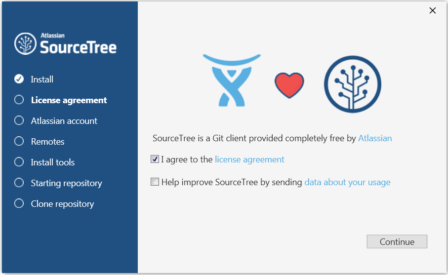
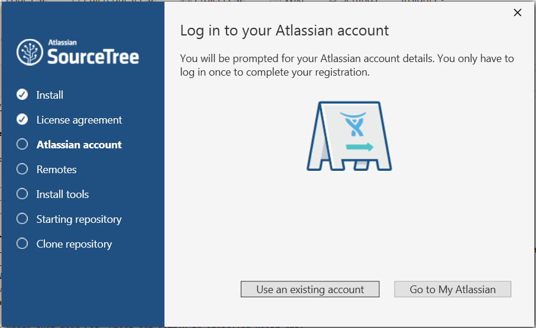
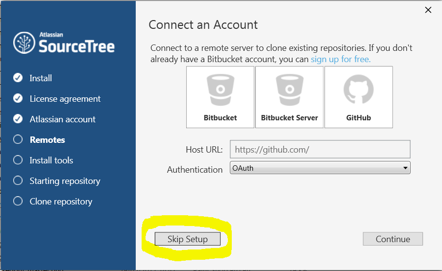
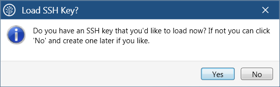
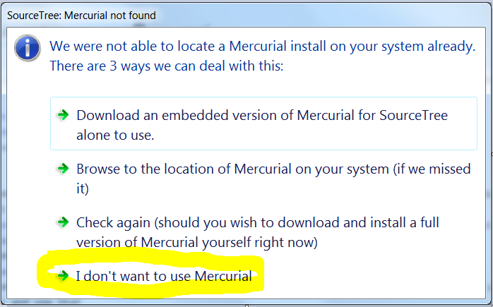
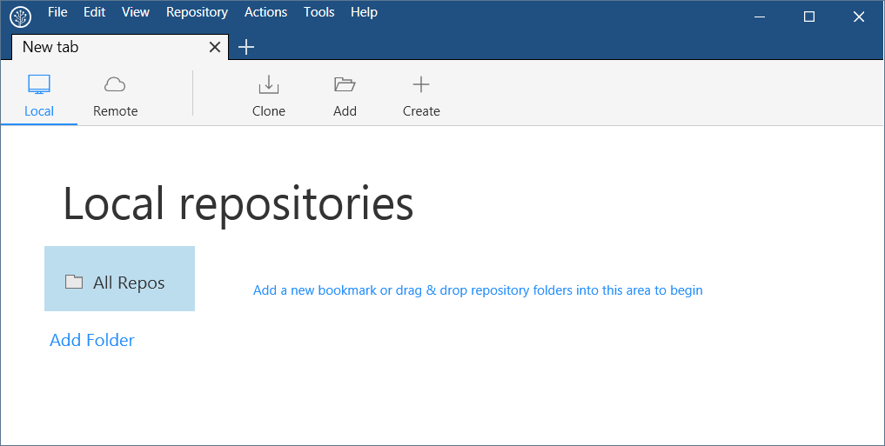

## How to install SourceTree on Windows

Here are instructions on how to install SourceTree on Windows.  This is a pre-requisite needed to do the exercises in the Version Control Workshop (https://github.com/NERC-CEH/git-introduction/blob/master/Exercises.md).

- In Windows Explorer **Open** Y:\user_apps\SouceTree\SourceTreeSetup-2.0.20.1.exe and fill in the details it asks for as follows (NOTE: the official download is at  https://www.sourcetreeapp.com that you may wish to use if outside CEH):

  - License Agreement: accept the license agreement

  - Atlassian account: either login to your existing account, or else Go to My Atlassian, create a new account (look for **Need an account? Sign up.**) and use that

  - Now **Skip Setup** - we will do everything else in the exercises

  - Load SSH Key?: No - this may be a later exercise

  - Mercurial not found: don't worry about this, just select the bottom option **I don't want to use Mercurial** - if you need to know, Mercurial is ....

  - You are now ready to do the exercises and should have SourceTree installed, open and looking like this:
